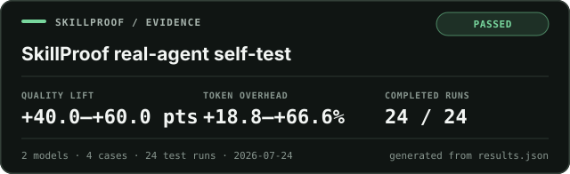

<div align="center">

# SkillProof

**Prove your Agent Skill works before you publish it.**

Compare clean baselines, automatic activation, and forced skill use across models. Measure quality, regressions, activation, tokens, cost, and latency. Keep the evidence.

[Quick start](#quick-start) · [Test](#tested-on-real-agents) · [How it stays fair](#how-it-stays-fair) · [Reports](#one-run-four-artifacts)

[](benchmarks/self/latest/report.html)

</div>

---

Anyone can publish a `SKILL.md` and say it helps. SkillProof asks the harder questions:

- Does it improve the artifact on realistic tasks?
- Does the agent load it when it should?
- Does it stay quiet on adjacent tasks?
- Does the gain survive another model or provider?
- How many extra tokens, dollars, and seconds does it cost?
- Did a new version quietly break a frozen case?

SkillProof is a dependency-free Node.js CLI plus a companion Agent Skill. The CLI executes and records the benchmark. The skill helps design evidence that is difficult to game.

## Tested on real agents

SkillProof tested itself across 24 real Codex generations: two models, two
positive tasks, two adjacent negative tasks, and three causal conditions.

| Model and setting | Runs | Automatic quality lift | Token overhead | Latency overhead | Regressions |
|---|---:|---:|---:|---:|---:|
| GPT-5.6 Luna, medium | 12 | **+40 points** | +66.6% | +93.1% | **0** |
| GPT-5.6 Terra, high | 12 | **+60 points** | +18.8% | +27.0% | **0** |

Every measured gate passed. Codex did not expose trusted skill-load telemetry,
so activation is reported separately as unmeasured rather than treated as a
failed quality test. The corpus is public and uses one repeat, so these numbers
describe this test—not every possible skill, model, or task.

**These values and the card above were generated by SkillProof itself from the
[full, path-sanitized `results.json`](benchmarks/self/latest/results.json).** Read the
[interactive report](benchmarks/self/latest/report.html) for every run,
assertion, limitation, and model-specific result.

## What one benchmark compares

| Arm | Target skill | Prompt | What it tells you |
|---|---|---|---|
| `without_skill` | inaccessible | original | clean baseline |
| `skill_available_auto` | discoverable | original | real automatic value and activation |
| `skill_forced` | explicitly invoked by the harness | same user request | potential value when activation succeeds |

Every model is reported separately. SkillProof does not hide a regression on one model inside an average from another.

## Quick start

Requires Node.js 20 or newer.

Run directly from GitHub:

```bash
npx github:Dafenxz0/skillproof init ./skills/my-skill
```

Or clone it for development:

```bash
git clone https://github.com/Dafenxz0/skillproof.git
cd skillproof
npm install
npm test
node bin/skillproof.js help
```

Edit the generated `skillproof.config.json`, then validate it:

```bash
npx github:Dafenxz0/skillproof validate --config skillproof.config.json
```

SkillProof will not execute configured agents, assertions, or judges until you explicitly allow it:

```bash
npx github:Dafenxz0/skillproof test ./skills/my-skill \
  --config skillproof.config.json \
  --allow-exec
```

## Install the companion skill

The companion skill teaches Codex, Claude Code, Cursor, and compatible agents how to design and interpret a defensible benchmark.

Codex:

```bash
npx skills add Dafenxz0/skillproof --skill skillproof --agent codex -y
```

Claude Code:

```bash
npx skills add Dafenxz0/skillproof --skill skillproof --agent claude-code -y
```

Cursor:

```bash
npx skills add Dafenxz0/skillproof --skill skillproof --agent cursor -y
```

Or ask Codex:

```text
$skill-installer install https://github.com/Dafenxz0/skillproof/tree/main/skills/skillproof
```

Then say:

```text
$skillproof design a release benchmark for this skill.
```

## Compare models, not just skills

Add one runner per exact provider/model/version/settings configuration. Two
reasoning levels of the same model are two runners, not one averaged result:

```json
{
  "runners": [
    {
      "id": "codex-terra",
      "adapter": "command",
      "preset": "codex",
      "provider": "openai",
      "model": "gpt-5.6-terra",
      "command": "codex",
      "parser": "jsonl",
      "skill_install": "codex-home",
      "reasoning_effort": "medium",
      "inherit_auth": true,
      "sandbox": "workspace-write",
      "billing_route": "chatgpt-subscription"
    },
    {
      "id": "codex-terra-high",
      "adapter": "command",
      "preset": "codex",
      "provider": "openai",
      "model": "gpt-5.6-terra",
      "command": "codex",
      "parser": "jsonl",
      "skill_install": "codex-home",
      "reasoning_effort": "high",
      "inherit_auth": true,
      "sandbox": "workspace-write",
      "billing_route": "chatgpt-subscription"
    },
    {
      "id": "claude-sonnet",
      "adapter": "command",
      "preset": "claude",
      "provider": "anthropic",
      "model": "claude-sonnet-5",
      "command": "claude",
      "parser": "jsonl",
      "skill_install": "claude-workspace",
      "max_turns": 12,
      "billing_route": "claude-subscription"
    }
  ]
}
```

You can compare GPT versions, reasoning settings, Claude models, Cursor agents,
or any CLI that accepts a prompt and returns machine-readable telemetry.
SkillProof records both the requested model and the model identities observed in
provider telemetry. Moving aliases should not be used for release claims unless
the observed identity is also recorded.

`inherit_auth` is deliberately explicit. Set it to `true` only when you want an
isolated Codex home to receive a copy of your existing CLI authentication. It is
`false` in generated starter files so a benchmark cannot inherit credentials by
surprise.

Codex defaults to `workspace-write`. Some native Windows Codex builds currently
degrade that mode to read-only. For a trusted fixture inside an outer VM or
container, `sandbox: "danger-full-access"` is available only when the runner also
sets `allow_unsandboxed: true`. SkillProof never selects that mode implicitly.

## Evidence changes with the skill

A single scoring recipe would reward the wrong thing.

| Profile | Strongest evidence |
|---|---|
| `technical` | hidden tests, builds, observable behavior, critical assertions |
| `behavioral-ui` | recovery sequences, race reversal, persistence, rendered controls |
| `visual` | identical screenshots, brief fidelity, responsive and accessible human review |
| `writing` | factual checks, citation coverage, blinded clarity and style review |
| `generic` | declared artifact contract plus independent checks |

A visual skill is not judged by whether files merely exist. A technical skill is not judged mainly by whether an evaluator likes its prose.

## How it stays fair

SkillProof builds the protocol around several non-negotiable rules:

1. Same original request in every arm.
2. Disposable, identical fixture copies.
3. Randomized arm order inside paired blocks.
4. Failed generations remain in the record.
5. Hidden assertions run unchanged against all artifacts.
6. Judge inputs use random candidate labels.
7. Activation comes from runtime telemetry, not output wording.
8. Missing tokens or prices remain unknown, never zero.
9. Prices come from a pinned, hashed snapshot.
10. Thresholds are frozen before the release run.

The recommended release suite is 20 positive cases, 20 hard negatives, three arms, and three repeats. Smaller suites are useful development evidence and are labelled accordingly.

## Quality, price, and tokens

SkillProof keeps three money concepts separate:

- provider-observed run estimate;
- API-equivalent estimate from the pinned catalog;
- subscription or quota billing, which is normally unavailable per run.

It never presents an API estimate as a Codex, ChatGPT, Claude, Cursor, Bedrock, or Vertex invoice.

Run:

```bash
node bin/skillproof.js prices
```

to inspect the bundled snapshot. Supply your own exact catalog with `--price-catalog` when a model, region, billing route, tool fee, or currency differs.

## One run, four artifacts

`results.json` is the evidence record:

- raw run outcomes;
- exact runner and model identity;
- assertion and judge scores;
- activation telemetry;
- tokens, cost, and latency;
- task-cluster confidence intervals;
- gates and regressions;
- skill, config, artifact, and catalog hashes;
- limitations.

`report.html` is a standalone, offline-readable “calibration ledger”:

- no CDN, font request, analytics, or server;
- baseline/skill/delta grammar throughout;
- model-by-model verdicts;
- per-case repeat evidence;
- light, dark, print, search, and downloadable JSON;
- accessible semantic tables;
- the exact footer: **This benchmark was generated with SkillProof.**

`card.svg` is a compact repository-ready summary generated from the same
evidence. It shows the verdict, quality lift, token overhead, completed runs,
model/case counts, and test date. Commit it beside the report and embed:

```md
[](./report.html)
```

`badge.json` is derived from the same result. Never hand-edit a badge into a claim the JSON does not support.

## Commands

```text
skillproof init [skill-path]
skillproof validate [config]
skillproof test [skill-path] --config file --allow-exec
skillproof report results.json
skillproof doctor
skillproof prices
```

Use `skillproof doctor` before an expensive run. It checks whether supported local agent commands are actually usable.

## Security

Generated code and third-party skills are untrusted.

SkillProof uses process argument arrays and disposable workspace copies. It does not use `shell: true`, and command execution requires `--allow-exec`. That is isolation, not a security sandbox. Use an unprivileged container or virtual machine for hostile fixtures, fail closed when a provider sandbox is unavailable, and never expose repository-wide secrets to candidate commands.

## What SkillProof will not claim

A passing report means:

> For this recorded corpus, skill version, runner, model, settings, and environment, the configured gates passed.

It does not prove the skill helps every model, every project, or every user. Public cases can be overfit. Judges can disagree. Model behavior changes. The report keeps those limits visible because honest scope is part of the product.

## Testing

```bash
npm test
npm run lint
npm run demo
```

The repository also contains a deliberately focused real-agent self-test:

```bash
npm run benchmark:self
```

It compares GPT-5.6 Luna at medium reasoning with GPT-5.6 Terra at high
reasoning over two positive benchmark/evidence tasks and two adjacent negative
coding tasks. Four public cases and one repeat make it useful for engineering
decisions, but not a universal release claim.

Use the cheaper worst-case token canary before the full matrix:

```bash
npm run benchmark:efficiency
```

See [CONTRIBUTING.md](CONTRIBUTING.md) before changing result schemas, pricing, or benchmark statistics.

## License

[MIT](LICENSE)
